# resume-forge

**One resume JSON. Sixteen designed themes. Print-perfect PDFs.**

[](LICENSE)
[](package.json)
[](#theme-gallery)
[](#adding-a-theme)

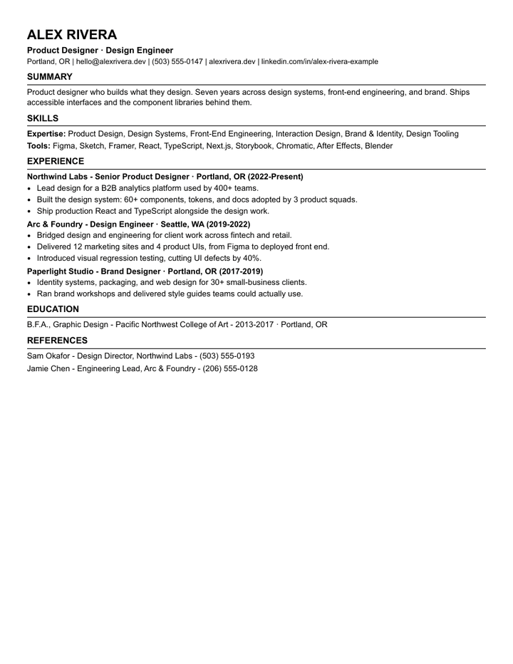

Your resume content lives in one JSON file. Every theme is a self-contained renderer that
turns that JSON into designed HTML and a pixel-accurate PDF through headless Chromium.
Change the data once, re-render every design. Tailor per application with a tiny overlay
file instead of maintaining sixteen documents.

## Quickstart

```bash
git clone https://github.com/vcspr/resume-forge && cd resume-forge
npm install && npx playwright install chromium
node forge.mjs --all                 # render the demo persona in all 16 themes
node forge.mjs --theme swiss --data my-resume.json
```

PDFs and HTML land in `output/`. Start `my-resume.json` by copying `data/base.json` and
replacing the demo content, or keep it partial: your file merges over the base, so you only
write the fields you change.

## Theme Gallery

Same data, nineteen designs. Click any thumbnail for full size.

| | | | |
|:---:|:---:|:---:|:---:|
| [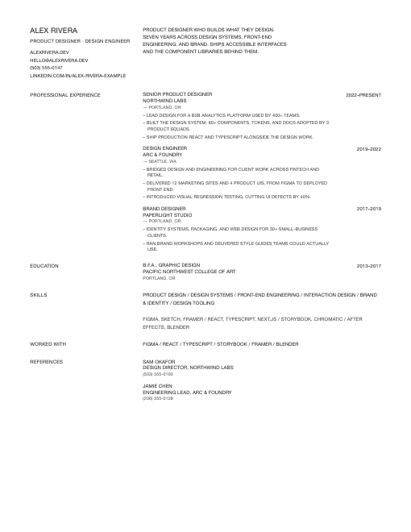](media/gallery/allcaps.png)<br>`allcaps` | [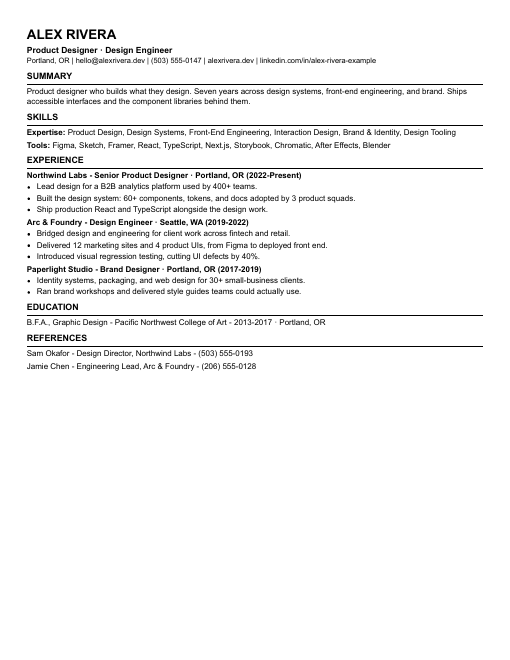](media/gallery/ats.png)<br>`ats` | [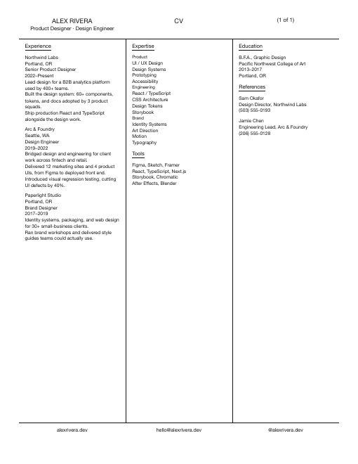](media/gallery/catalog.png)<br>`catalog` | [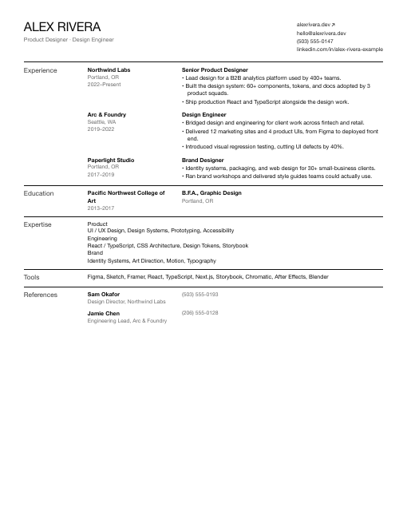](media/gallery/editorial.png)<br>`editorial` |
| [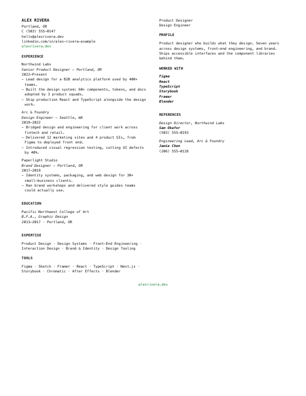](media/gallery/greenlink.png)<br>`greenlink` | [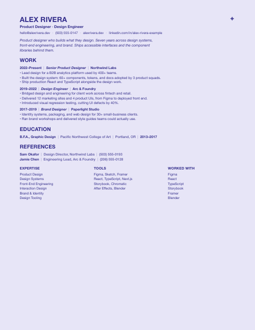](media/gallery/indigo.png)<br>`indigo` | [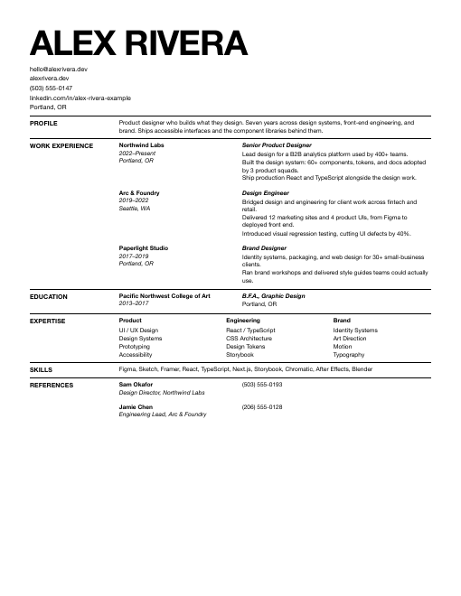](media/gallery/ledger.png)<br>`ledger` | [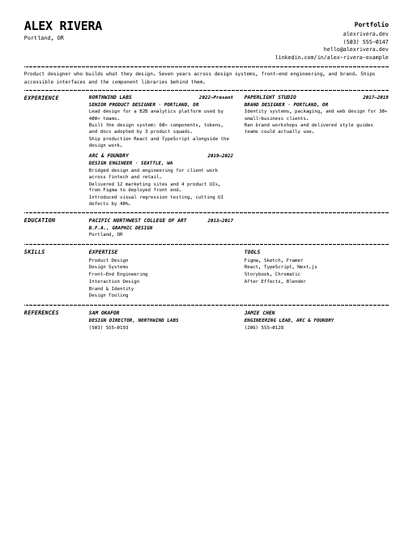](media/gallery/monodotted.png)<br>`monodotted` |
| [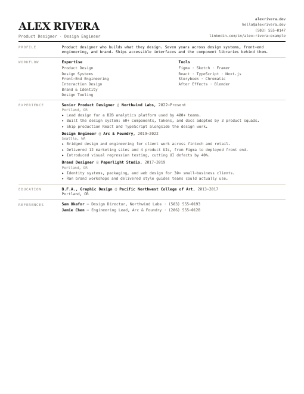](media/gallery/monomemo.png)<br>`monomemo` | [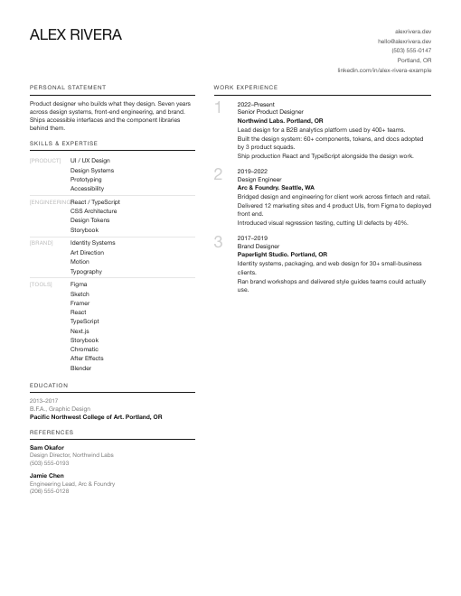](media/gallery/numbered.png)<br>`numbered` | [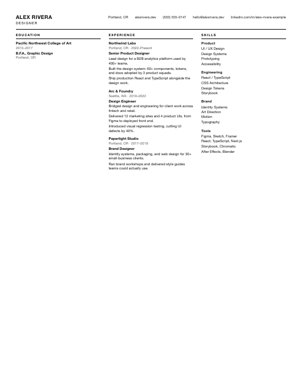](media/gallery/quad.png)<br>`quad` | [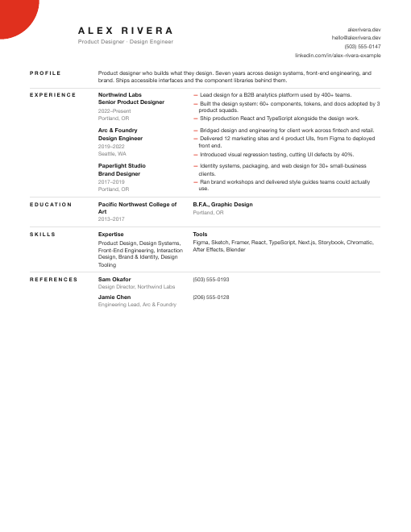](media/gallery/redaccent.png)<br>`redaccent` |
| [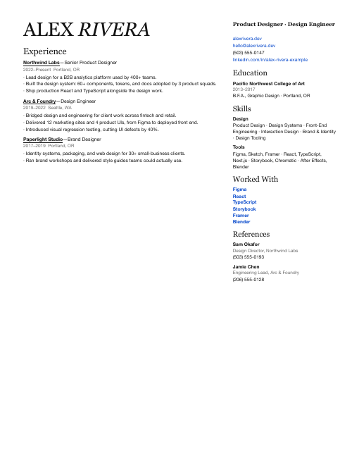](media/gallery/serif.png)<br>`serif` | [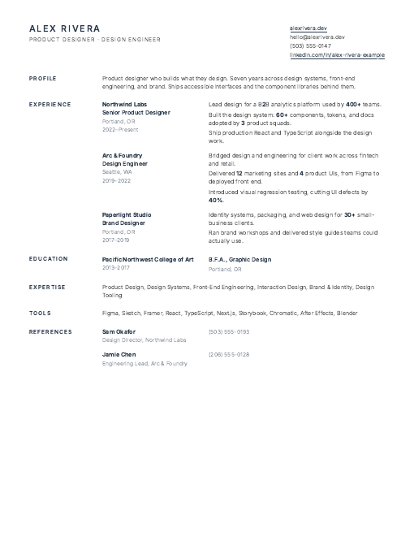](media/gallery/slate.png)<br>`slate` | [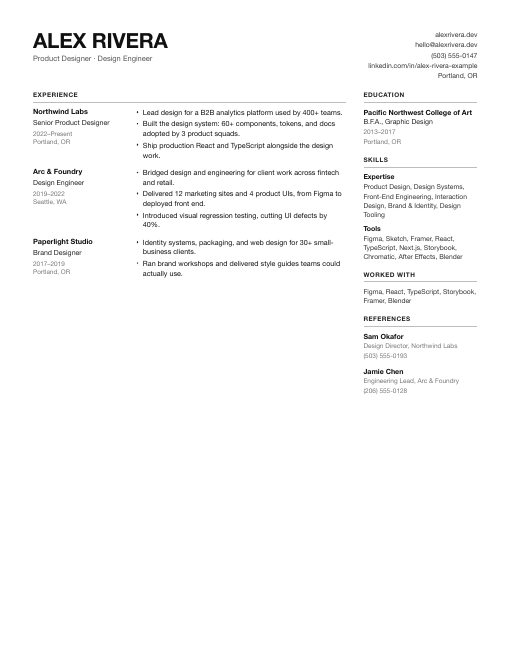](media/gallery/standard.png)<br>`standard` | [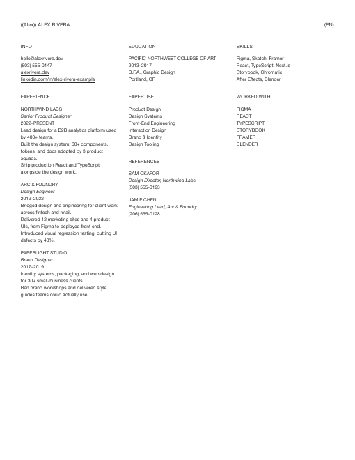](media/gallery/swiss.png)<br>`swiss` |
| [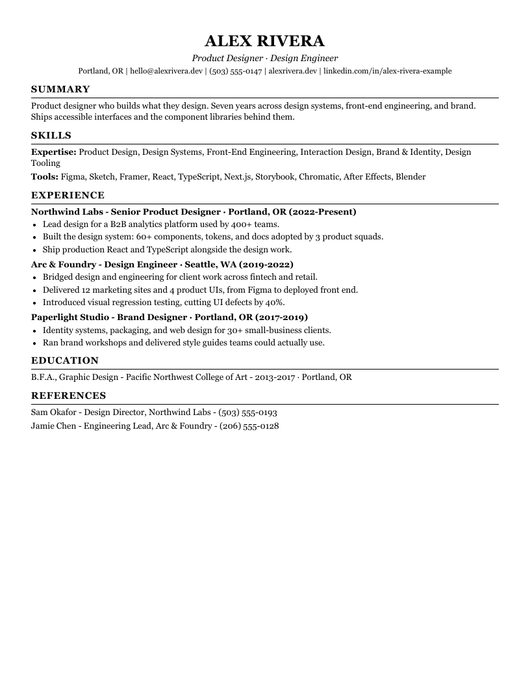](media/gallery/atsserif.png)<br>`atsserif` | [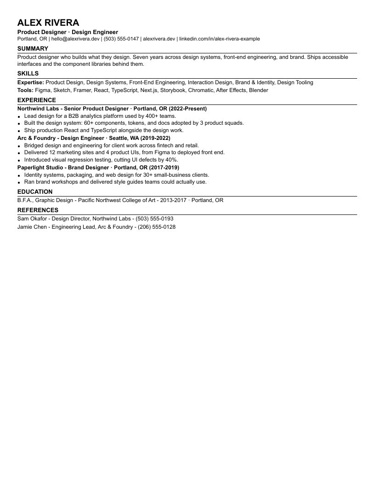](media/gallery/atscompact.png)<br>`atscompact` | [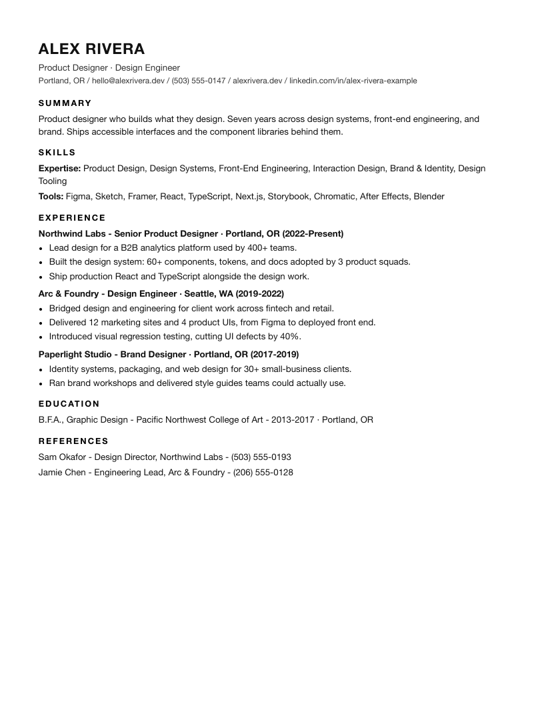](media/gallery/atsminimal.png)<br>`atsminimal` | |

**Four ATS-safe themes** are deliberately plain (single column, standard headers, hyphens
only) so applicant tracking systems parse them cleanly, each for a different room:
`ats` (bare, and also emits a paste-ready `.txt`), `atsserif` (conservative serif for
finance, law, academia), `atscompact` (9pt, fits a long career on one page), and
`atsminimal` (airy modern sans). Use the other fifteen for humans.

## Your Resume Is One JSON File

```jsonc
{
  "name": "ALEX RIVERA",
  "headline": "Product Designer · Design Engineer",
  "email": "hello@alexrivera.dev",
  "profile": "Product designer who builds what they design...",
  "experience": [
    {
      "org": "Northwind Labs",
      "dates": "2022–Present",
      "role": "Senior Product Designer · Portland, OR",
      "bullets": ["Lead design for a B2B analytics platform used by 400+ teams."]
    }
  ],
  "education": [...], "expertise": [...], "tools": [...], "references": [...]
}
```

Full schema with every field: [`data/base.json`](data/base.json).

**Per-application tailoring:** keep your master JSON, then write a small overlay per job
that only overrides what changes (headline, profile, bullet emphasis) and pass it with
`--data`. Overlays merge over the base; arrays replace, objects deep-merge.

## How It Works

1. `forge.mjs` dispatches to a theme renderer in [`themes/`](themes/).
2. Each theme merges your JSON over `data/base.json`, then builds a self-contained HTML
   document. All layout is CSS; `@page` rules own the print geometry.
3. Playwright's headless Chromium prints the HTML to PDF with `preferCSSPageSize`, so the
   PDF matches the HTML exactly. Renderers report content height and warn when a resume
   is about to spill past one page.

No frameworks, no build step, no config files. Each theme is one readable `.mjs` file.

## Adding a Theme

Copy the closest existing theme in `themes/`, keep the argument and merge conventions,
swap the HTML and CSS. If it renders `data/base.json` to one clean page, it is a theme.
PRs welcome.

## Roadmap

- [x] Overlay examples for common tailoring scenarios: see [`examples/`](examples/)
- [ ] Page-fit autotuner: nudge spacing variables until content fits one page
- [x] Cover letter sharing the same data file: `node letter.mjs --in examples/letter.json`
- [ ] Hosted rendering and tailoring service (exploring)

## License

[MIT](LICENSE) © 2026 Victor Uwakwe
